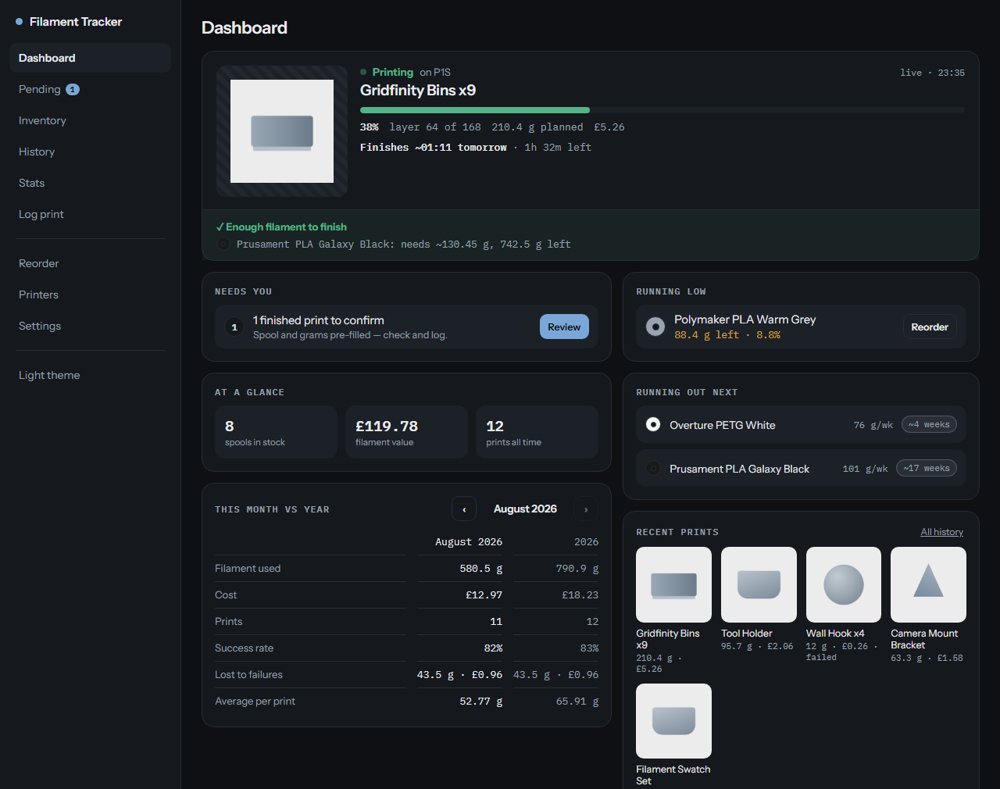
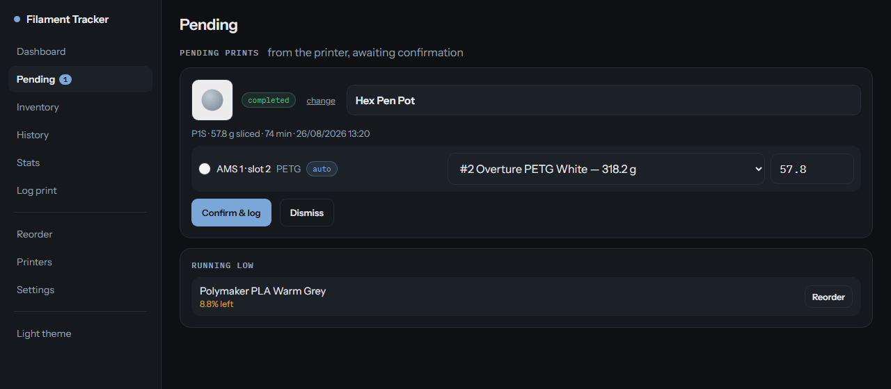
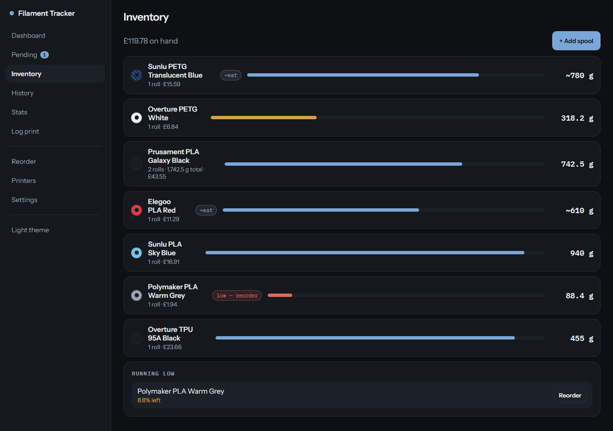
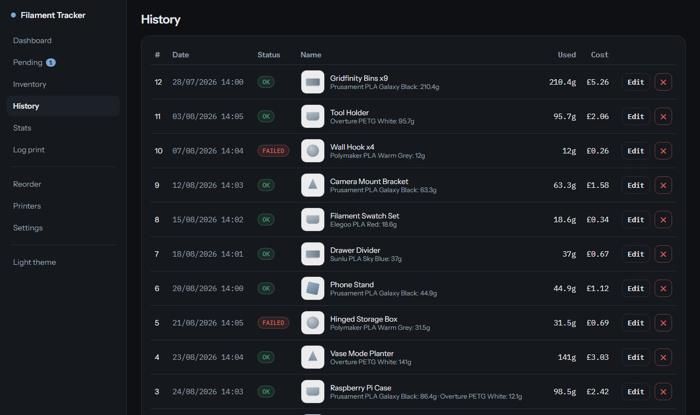
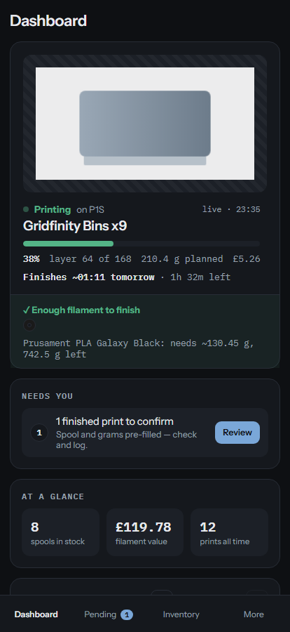

# Bambu Filament Tracker

Self-hosted filament tracking for **Bambu Lab** printers that logs your prints for you.

It talks to your printer over the local network — no cloud account — so when a print
finishes it already knows the model, the outcome, which AMS slot fed it, and the
**exact grams from the sliced file**. You confirm; it deducts from the right spool.

Built and running against a **P1S**. Should work on any Bambu machine that exposes
LAN MQTT and FTPS (X1/X1C, P1P/P1S, A1/A1 mini) — see [Printer support](#printer-support).

> Self-hosted and LAN-only by design. No cloud accounts, no telemetry, nothing leaves
> your network — and it [scales to a farm](#scales-to-a-print-farm) of printers.

<sub>All screenshots below use demo data — the filaments, print names and model
previews are fabricated.</sub>

---

## Why

Filament spreadsheets die because nobody updates them. This one updates itself: the
printer is the source of truth for what was printed, and the slicer is the source of
truth for how much it used. The only thing left for a human is confirming which
physical spool was loaded — and after the first time, it remembers that too.

---

## The dashboard



The landing page is **contextual** — each block only appears when it has something to
say, so a quiet workshop shows a short page and a busy one surfaces exactly what needs
attention.

While a print is running it leads with the model preview, progress, layer count and the
**clock time it will finish**. Underneath sits the feature that motivated the whole
project: it takes the sliced weight, subtracts what's already been laid down, and
compares that against the spool actually loaded — so it can tell you **"enough filament
to finish"**, or warn you that you're 12 g short, while there's still time to do
something about it.

Below that: what needs confirming, what's running low, at-a-glance totals, this month
against this year, what runs out next, and recent prints.

---

## Confirming a finished print



Nothing is ever deducted behind your back. When a print ends, it lands here already
filled in — the model name, whether it succeeded, which AMS slot it drew from, and the
grams read from the sliced file (the `auto` badge marks figures that came from the
slicer rather than a guess).

The spool is pre-selected from the mapping it learned the first time you used that
slot, so confirming is usually a single click. Everything stays editable: rename the
print, flip the outcome, correct the grams, or dismiss it entirely.

For a **failed** print it scales the sliced weight by how far the print actually got,
so a job that died at 40% doesn't charge you for the whole thing.

---

## Inventory



Rolls are grouped by brand, material and colour, so three identical black PLAs collapse
into one line. The weight shown is the **roll currently in use** — the one that matters
when you're deciding whether to start a print — with spares counted alongside.

The swatch is resolved from your own free-text colour name, and translucent filaments
are drawn with a stripe so they don't look identical to their solid equivalents.
A `~` marks a weight that's still an estimate, until you weigh the roll and confirm it.

Fill bars shift from blue to amber to red as a roll runs down, and anything under 10%
raises a reorder warning you can mark as *ordered* or *ignored*.

---

## Every print, costed



Give a spool its price and every print gets a cost, worked out from the grams it
actually used. Editing a print's grams corrects the spool weight; deleting one puts the
filament back.

Costs are only ever shown when they're knowable: a print on an unpriced spool shows
`—` rather than a fabricated £0.00, and a multi-material print where only some spools
have prices shows a `+` suffix to say the figure is partial.

---

## On a phone

<p align="center">
  
</p>

The same app, laid out for the place you actually use it — stood at the printer.
Navigation moves to a bottom bar, the run-out verdict stays above the fold, and tap
targets are sized for mucky fingers. Dark theme by default, light theme a tap away.

---

## Scales to a print farm

Nothing about the design assumes a single machine. Add as many printers as you like
under **Printers** and the listener opens an independent MQTT connection to each,
picking up additions and removals within 30 seconds — no restart, no redeploy.

- **The dashboard shows every printer**, with whatever is actually printing sorted to
  the top, each with its own progress, ETA and will-it-finish verdict.
- **Slot mappings are per printer.** "AMS 1 · slot 3" on one machine is a different
  thing from the same slot on another, so a shared spool library stays unambiguous.
- **One filament inventory across the farm** — which is usually what you want, since
  the spools move between machines.
- **Every capture carries its printer**, so history tells you which machine ran what.

Sensible limits to know before pointing it at a large farm: state lives in a single
JSON file served by one gunicorn worker, which is deliberate — it keeps writes
serialised and the whole thing dependency-free. That comfortably handles a handful of
machines and a single operator; it is not built for hundreds of printers or for several
people writing at once. It has been run in anger against one P1S, so treat multi-printer
as designed-for and lightly-travelled rather than battle-tested.

---

## Quick start

```bash
git clone https://github.com/TechKno/bambu-filament-tracker.git
cd bambu-filament-tracker/web
docker compose up -d --build
```

Open **http://localhost:8087**. Two containers start: the web app, and the listener
that watches your printers.

Then add your printer under **Printers**:

| Field | Where to find it |
| --- | --- |
| IP address | Printer screen → Settings → WLAN, or your router |
| Serial | Printer screen → Settings → Device, e.g. `01P00C…` |
| Access code | Printer screen → **Settings → WLAN → Access Code** |

The listener connects within 30 seconds — no restart needed. Access codes are stored
server-side and never shown again.

To change the port, edit the `ports:` line in `docker-compose.yml`
(`"8087:8000"` → `"<your-port>:8000"`).

## Printer support

The listener needs two things, both on your LAN:

| Protocol | Port | Credentials | Used for |
| --- | --- | --- | --- |
| MQTT over TLS | 8883 | `bblp` / access code | `device/<serial>/report` — live state, print start/finish |
| FTPS (implicit) | 990 | `bblp` / access code | the sliced `.3mf` — per-filament `used_g` and plate preview |

Both certificates are self-signed by Bambu, so verification is disabled — fine on a
LAN. **LAN-only mode works**, and the app keeps working if Bambu's cloud is down.

### Bambu specifics worth knowing

These shaped the implementation, and are useful if you're adapting it:

- `remain` is only meaningful for genuine Bambu RFID spools; third-party spools report
  `-1` and `tray_weight: "0"`. That's why grams come from the sliced file.
- Purge/flush is already baked into `used_g`, so deductions include waste — there's no
  separate purge figure to report.
- `gcode_file` is cleared the instant a print ends, so it's captured at print *start*.
- `tray_now` is `254`/`255` for the external spool; AMS trays are `unit*4 + tray`. The
  UI shows units and slots 1-based while stored keys stay 0-based.
- `subtask_name` is the slicer *project* name, so prints often arrive called something
  like `0.2mm layer, 3 walls, 30% infill` — hence the editable name field.
- Tray colours arrive as `RRGGBBAA` hex; your inventory colour names are free text,
  resolved by `src/colors.js`.

## Data and secrets

Everything lives in `web/data/` (bind-mounted to `/data`):

| File / folder | Contents |
| --- | --- |
| `filament_data.json` | Spools and prints — the source of truth |
| `backups/` | Timestamped copies, last 20 |
| `settings.json` | Auth config (password is hashed) |
| `printers.json` | Configured printers (not secret) |
| `printer_status.json` | Latest live status per printer |
| `pending/`, `loads/` | Captures and load prompts awaiting confirmation |
| `slot_map.json`, `tray_state.json` | Remembered slot → spool mapping |
| `thumbnails/` | Model previews from sliced files |
| `recordings/` | Optional raw MQTT snapshots |

`web/secrets/` holds printer access codes. Both folders are git-ignored and excluded
from deployment archives, so redeploying never touches live data.

On first run an empty `filament_data.json` is created; to bring existing data across,
drop your file into `web/data/` before starting.

## Development

```bash
# backend (Flask dev server on :8000)
cd web/backend
python -m venv .venv && .venv/bin/pip install -r requirements.txt
FILAMENT_DATA_DIR=../data .venv/bin/python app.py

# frontend (Vite on :5173, proxies /api to :8000)
cd web/frontend
npm install && npm run dev
```

On Windows use `.venv/Scripts/…` instead of `.venv/bin/…`. To develop against a
running instance's data, point the proxy in `vite.config.js` at it.

### Tests

```bash
python web/backend/_smoketest.py        # API surface
python web/backend/_pending_test.py     # pending / dashboard / printers
cd web/listener && python _parser_test.py   # MQTT parser
cd web/listener && python _ftp_test.py      # 3MF parsing
```

All four are self-seeding and run against synthetic Bambu payloads — **no printer
needed**. Roughly 95 checks covering the deduction maths, confirm-first flow,
cost/period logic, and the parser's state machine.

## Layout

```
web/
  backend/
    core.py        # domain model + business logic (data, prints, stats, forecast)
    app.py         # Flask API + serves the built SPA
    pending.py     # confirm-first capture store
  listener/
    listener.py    # MQTT client, per-printer
    parser.py      # pure Bambu report parser (unit-tested, no I/O)
    bambu_ftp.py   # implicit-FTPS 3MF fetch: per-filament grams + preview
  frontend/src/
    pages/         # one file per screen
    components/    # SpoolIcon, Modal, Login
    colors.js      # filament colour resolution + spool ranking
    api.js         # fetch wrapper and display formatters
    styles.css     # design system: tokens, type, shared components
  data/            # runtime data (volume)
  secrets/         # printer access codes (volume)
```

## Notes

- Timestamps are local (`TZ=Europe/London` in `docker-compose.yml`; handles GMT/BST).
- Currency is GBP — one line in `src/api.js`.
- One gunicorn worker keeps JSON writes serialised, which is correct for a
  single-user tool. It is not built for concurrent writers.
- `styles-legacy.css` holds styling for screens not yet rebuilt against the current
  design system; it shrinks as each screen is converted.

## License

[PolyForm Shield 1.0.0](LICENSE) — source-available, not OSI "open source".

Use it for anything you like, including commercially: run it at home, in a
makerspace, or behind a print farm you sell parts from. Modify it, self-host it,
share your changes.

The one thing you may not do is **sell it, or offer it as a product or service that
competes with it** — no reselling, no paid hosting of it, no repackaging it as your
own tool.

<sub>Plain-English summary, not legal advice — the [licence text](LICENSE) governs.</sub>
